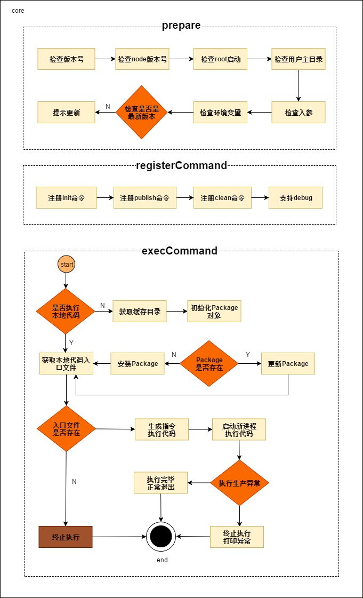

# forestar-cli脚手架开发文档

## 什么是编程中脚手架

脚手架是一种元编程的方法，用于构建基于数据库的应用。
程序员写一份规格说明书来描述怎么去使用数据库，由编译器来根据这份规格说明书生成相应的代码，进行增删改查数据库的操作，我们把这种模式称为脚手架，基于脚手架去更高效的建造出强大的应用。

## forestar-cli架构设计图

## 拆包策略

## 执行流程

### core执行流程图
